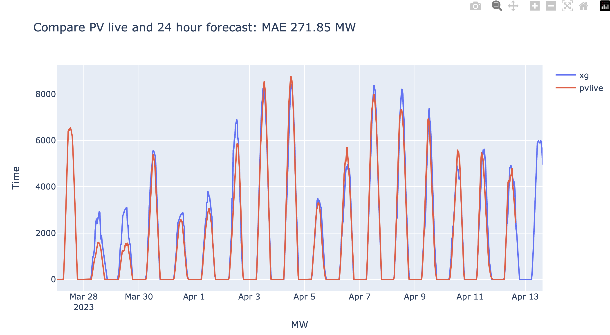

# 24 hours forecast

Want to compare the live 24 hour forecast and the backtest. The backtest shows a MAE OF 2.5% over 1 year. 

The live forecast shows a MAE over 2 weeks in April were 271.85 / 13000 = 2.09%

